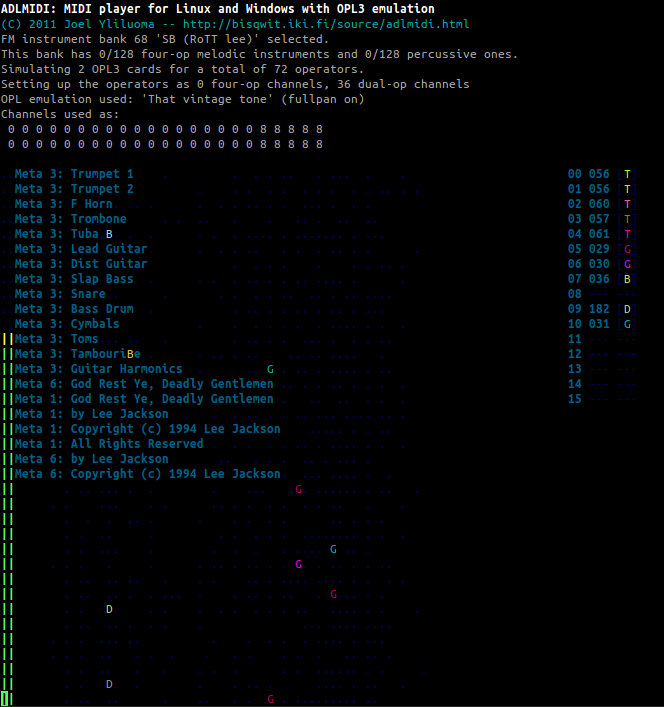
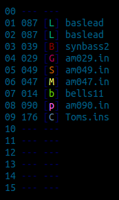
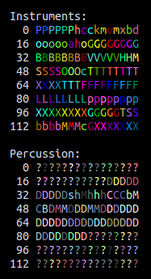

adlseq
=======

`adlseq` is a a multitimbral softsynth that uses two or four-operator FM-synthesis to generate sounds.

It performs emulation of the OPL3 sound chip and is based on
[ADLMIDI](http://bisqwit.iki.fi/source/adlmidi.html) by Joel Yliluoma. This is
the sound chip that was in Soundblaster Pro 2.0 and was commonly used for music
in 80s-90s video games.

Separate executables are provided for playing MIDI files and for receiving MIDI input from ALSA sequencer input.



Features:

* OPL3 (Yamaha YMF262) emulation with four-operator mode support
* 67 banks with 4500+ FM patches from a large number of PC games, copied from files typical to AIL = Miles Sound System / DMX / HMI = Human Machine Interfaces / Creative IBK.
* Stereo sound
* Reverb filter based on code from SoX, based on code from Freeverb. A copy of either project is not needed.
* Number of simulated soundcards can be specified as 1-100 (maximum channels 1800!)
* xterm-256color support
* ~~WIN32 console support (also tested with HXRT / MS-DOS)~~ (currently broken)
* Pitch-bender with adjustable range
* Vibrato that responds to RPN/NRPN parameters
* Sustain enable/disable
* MIDI and RMI file support
* loopStart / loopEnd tag support (Final Fantasy VII)
* Use automatic arpeggio with chords to relieve channel pressure
* Support for multiple concurrent MIDI synthesizers (per-track device/port select FF 09 message), can be used to overcome 16 channel limit

This fork adds the following:

* `adlseq`: Play MIDI events from ALSA or JACK sequencer socket. This means that it can be connected
  to other MIDI sources (like games, keyboards or sequencer programs) with `aconnect` or the interface
  of the program itself.
* A legend showing what instrument is active on what MIDI channel
* Selectable OPL3 emulator (using `-emu=...`). Due to different approximations of the hardware, the emulators have a slightly different FM sound. They also
  differ in CPU usage.
  * `dbopl`: Old DOSBOX OPL3, which uses some floating-point math.
  * `dboplv2`: New DOSBOX OPL3 which is fully based on fixed-point math (default, as in ADLMIDI).
  * `vintage`: 'That vintage tone' emulator by Robson Cozendey ported to C++
    from zdoom. A detailed description and Java applet version can be found on
    http://opl3.cozendey.com/. It is very accurate, but also CPU-heavy since
    this emulator uses floating point and has a more fine-grained envelope
    generator. It can produce sometimes a crystal-clear, denser kind of OPL3
    sound that, because of that, may be useful for creating other new music.
  * `ymf262`: YMF262 emulator from MAME (via VGMPlay).
* Full stereo panning (using `-fp`). Instead of instruments popping from side to side, they can smoothly pan. Like in zdoom
  this is done with a small change to the emulators, instead of by duplicating the instrument on two channels as would be necessary
  with a real OPL3. Not yet supported for `ymf262` and `dboplv2` emulators.
* Performance improvements in the audio output handling. The original ADLMIDI locks the audio buffer
  for a longer than needed due to unnecessary random-indexing in std::deque. Still a work in progress.
* Slight modularization and clean-up of the code (split ui, audio output, MIDI event processor into separate files)
* Reverb can be disabled with a command-line flag. This is mainly useful when the intent is to
  record and add effects later, but it will also use less CPU.
* JACK audio output support. 
* It is possible to select instruments from the full selection of banks by
  sending Bank LSB controller changes, if enabled with `-bs`.
* CMake-based build system instead of separate makefiles.
* More extensive 256-color support. Instrument colors in the visualization come from the whole set of 256 colors.

This fork breaks the following:

* Tetris went missing in an early code move :( Ideally this should be reintegrated, or else some roguelike game.
* Windows support (needs to be implemented in new cmake build system)
* Non-256 color terminal support (I think this should be an option, although only few modern terminals are not 256-color,
especially given that Windows support is broken)

Usage
------
```
Usage: adlmidi <midifilename> [ <options> ] [ <banknumber> [ <numcards> [ <numfourops>] ] ]
       adlmidi <midifilename> -1   To enter instrument tester
 -p Enables adlib percussion instrument mode
 -t Enables tremolo amplification mode
 -v Enables vibrato amplification mode
 -s Enables scaling of modulator volumes
 -nl Quit without looping
 -w Write WAV file rather than playing
 -em=<emu> Set OPL emulator to use (dbopl, dboplv2, vintage, ymf262)
 -fp Enable full stereo panning
 -bs Allow bank switch (Bank LSB changes bank)
 -noreverb Disable reverb
    Banks: 0 = AIL (Star Control 3, Albion, Empire 2, Sensible Soccer, Settlers 2, many others)
           1 = Bisqwit (selection of 4op and 2op)
           2 = HMI (Descent, Asterix)
           3 = HMI (Descent:: Int)
           4 = HMI (Descent:: Ham)
           5 = HMI (Descent:: Rick)
           6 = HMI (Descent 2)
           7 = HMI (Normality)
           8 = HMI (Shattered Steel)
           9 = HMI (Theme Park)
          10 = HMI (3d Table Sports, Battle Arena Toshinden)
          11 = HMI (Aces of the Deep)
          12 = HMI (Earthsiege)
          13 = HMI (Anvil of Dawn)
          14 = DMX (Doom           :: partially pseudo 4op)
          15 = DMX (Hexen, Heretic :: partially pseudo 4op)
          16 = DMX (MUS Play       :: partially pseudo 4op)
          17 = AIL (Discworld, Grandest Fleet, Pocahontas, Slob Zone 3d, Ultima 4, Zorro)
          18 = AIL (Warcraft 2)
          19 = AIL (Syndicate)
          20 = AIL (Guilty, Orion Conspiracy, Terra Nova Strike Force Centauri :: 4op)
          21 = AIL (Magic Carpet 2)
          22 = AIL (Nemesis)
          23 = AIL (Jagged Alliance)
          24 = AIL (When Two Worlds War :: 4op, MISSING INSTRUMENTS)
          25 = AIL (Bards Tale Construction :: MISSING INSTRUMENTS)
          26 = AIL (Return to Zork)
          27 = AIL (Theme Hospital)
          28 = AIL (National Hockey League PA)
          29 = AIL (Inherit The Earth)
          30 = AIL (Inherit The Earth, file two)
          31 = AIL (Little Big Adventure :: 4op)
          32 = AIL (Wreckin Crew)
          33 = AIL (Death Gate)
          34 = AIL (FIFA International Soccer)
          35 = AIL (Starship Invasion)
          36 = AIL (Super Street Fighter 2 :: 4op)
          37 = AIL (Lords of the Realm :: MISSING INSTRUMENTS)
          38 = AIL (SimFarm, SimHealth :: 4op)
          39 = AIL (SimFarm, Settlers, Serf City)
          40 = AIL (Caesar 2 :: partially 4op, MISSING INSTRUMENTS)
          41 = AIL (Syndicate Wars)
          42 = AIL (Bubble Bobble Feat. Rainbow Islands, Z)
          43 = AIL (Warcraft)
          44 = AIL (Terra Nova Strike Force Centuri :: partially 4op)
          45 = AIL (System Shock :: partially 4op)
          46 = AIL (Advanced Civilization)
          47 = AIL (Battle Chess 4000 :: partially 4op, melodic only)
          48 = AIL (Ultimate Soccer Manager :: partially 4op)
          49 = AIL (Air Bucks, Blue And The Gray, America Invades, Terminator 2029)
          50 = AIL (Ultima Underworld 2)
          51 = AIL (Kasparov's Gambit)
          52 = AIL (High Seas Trader :: MISSING INSTRUMENTS)
          53 = AIL (Master of Magic, Master of Orion 2 :: 4op, std percussion)
          54 = AIL (Master of Magic, Master of Orion 2 :: 4op, orchestral percussion)
          55 = SB (Action Soccer)
          56 = SB (3d Cyberpuck :: melodic only)
          57 = SB (Simon the Sorcerer :: melodic only)
          58 = OP3 (The Fat Man 2op set)
          59 = OP3 (The Fat Man 4op set)
          60 = OP3 (JungleVision 2op set :: melodic only)
          61 = OP3 (Wallace 2op set, Nitemare 3D :: melodic only)
          62 = TMB (Duke Nukem 3D)
          63 = TMB (Shadow Warrior)
          64 = DMX (Raptor)
     Use banks 2-5 to play Descent "q" soundtracks.
     Look up the relevant bank number from descent.sng.

     The fourth parameter can be used to specify the number
     of four-op channels to use. Each four-op channel eats
     the room of two regular channels. Use as many as required.
     The Doom & Hexen sets require one or two, while
     Miles four-op set requires the maximum of numcards*6.
```

`adlseq`, the ALSA midi backend, works the same way and currently needs a dummy
file argument, then optional switches, then the bank,

```bash
adlseq dummy -fp -emu=vintage 64
```

It will then print on what port it is listening, for example:
```
Waiting for data at port 129:0.
```

It is not currently possible to provide port(s) to connect to on the command line. Connections to
other programs and devices can be made in QJackCtl or with `aconnect` on the command line.

Interface
----------

On first glance, adlmidi has a strange ASCII-based interface with characters jumping
around like in a roguelike game.

The grid on the left shows which instruments are playing on which
OPL channels by drawing a text character. The horizontal position is
determined by the pitch of the note, the vertical position by the channel
number. Four-operator or pseudo-4op instruments will be active on two channels.

- An empty space or `.` means that there is no activity.
- A colored letter means an instrument is playing at the pitch and on the channel. Each instrument gets
  an unique letter/color if possible.
- `<` means an instrument was played with a pitch bend.
- `%` means that the note is releasing (mistakingly, I think, called sustaining in the source).

Diagnostic messages are overlayed on this in blue text.



The right pane shows a legend of what instrument is active on each of the 16 MIDI channels. The
numbers shown are subsequently

1. the channel number
2. the patch number (0..127 for instruments, 128..255 for percussion)
3. the symbol used to render this instrument in the grid, this depends on the patch number as shown in the image below

  

4. the name of the instrument (from the original bank). The color of the instrument name is
    - *dark blue* if the instrument is soundless
    - *cyan* if two-operator FM 
    - *light blue* if pseudo-four operator FM (two two-operator instruments playing at the same time)
    - and *bright cyan* if four-operator FM

MIDI Controllers
-----------------

`adlseq` implements the following MIDI controller events. All controller
changes take effect immediately:

 CC, RPN or NRPN                | Parameter
 -------------------------------|-------------------------
 CC 0 (Bank MSB)                | Bank MSB (currently unused)
 CC 32 (Bank LSB)               | Bank number when started with -bs option
 CC 1 (Vibrato MSB)             | Adjust vibrato
 CC 5 (Portamento Time MSB)     | Portamento Time (currently unused)
 CC 37 (Portamento Time LSB)    | Portamento Time (currently unused)
 CC 7 (Main Volume MSB)         | Volume Coarse
 CC 10 (Panning MSB)            | Stereo Panning (binary, unless started with -fp option)
 CC 11 (Expression MSB)         | Expression (another volume factor)
 CC 64 (Sustain Pedal)          | Enable/Disable Sustain
 CC 65 (Portamento On/Off)      | Enable/Disable Portamento (currently unused)
 CC 120 (All Sounds Off)        | Turn all sounds on channel off
 CC 121 (Reset All Controllers) | Set all controllers to default values
 CC 123 (All Notes Off)         | Release all notes on channel
 CC 6,38,98,99,100,101          | Set RPNs and NRPNs
 RPN MSB 0 LSB 0                | Pitch-bender Sensitivity
 NRPN MSB 1 LSB 8               | Vibrato speed
 NRPN MSB 1 LSB 9               | Vibrato depth
 NRPN MSN 1 LSB 10              | Vibrato delay (in milliseconds)

Build
------
If necessary, first install the dependencies. On Ubuntu:

```bash
sudo apt-get install libsdl1.2-dev libasound2-dev
```

For JACK audio support
```bash
sudo apt-get libjack-dev
```

Then create a build directory, configure the build settings using `cmake-gui`
(GUI), `cmake` (command-line) or `ccmake` (text-mode configuration) and build
using make,
e.g.:
```bash
mkdir build
cd build
ccmake ..
make -j3
```

A few useful configuration options are:

 Name                   | Description
 -----------------------|-------------------------
 `CMAKE_BUILD_TYPE`     | Build type `Debug`, `Release` or `RelWithDebInfo` (default `RelWithDebInfo`)
 `BuildForAMD_X86_64`   | Build for AMD x86_64 system
 `BuildForCore2_X86_64` | Build for Intel Core2 x86_64 system
 `DefaultAudio`         | Audio driver: `sdl` or `jack`

And all the executables will be built:

- `adlmidi`: MIDI player
- `adlseq`: ALSA sequencer
- `gen_adldata`: Generate `adldata.cc` (only needed if you want to add instrument banks)
- `dumpmiles`
- `dumpbank`

Known issues
-------------
- Output level of different OPL3 emulators is different. `vintage` produces louder sound than `dboplv2`, for example

- The new interface requires a 256-color terminal. Look into using libtcod for platforms that don't have the appropriate
  terminal support (or on top of Qt/GTK, see Hexter's "Retro" patch editing mode).

Would be nice
--------------

- Giving control over the various OPL3 parameters through Midi CCs, to customize instruments on the fly
  for more expression.

Copying
--------
ADLMIDI is distributed under the terms of the General Public License version 3 (GPL3).

The OPL3 emulator within is from DOSBox is licensed under GPL2+.

The FM soundfonts (patches) used in the program are imported from various PC
games without permission from their respective authors. The question of
copyright, when it comes to sets of 11 numeric bytes, is somewhat vague,
especially considering that most of those sets are simply descendants of the
patch sets originally published by AdLib Inc. for everyone's free use.

OPL3 emulators:
  * `dbopl`: Available under the terms of the GNU LGPL.
  * `dboplv2`: Available under the terms of the GNU GPL2+.
  * `vintage`: Available under the terms of the GNU LGPL.
  * `ymf262`,`ym3812`: Available under non-commercial, open-source license terms (MAME license).

Authors
--------
* Joel Yliluoma <bisqwit@iki.fi>
* Wladimir J. van der Laan <laanwj@gmail.com>

See also
---------

* [ADLMIDI](http://bisqwit.iki.fi/source/adlmidi.html) site by Joel Yliluoma 
* [OPL synth emulation](http://zdoom.org/wiki/OPL_synth_emulation) on ZDoom wiki

Other FM synthesis
--------------------
`adlseq` is by no means the only OSS softsynth that does FM emulation. Various others are

* [Hexter](http://dssi.sourceforge.net/hexter.html) Yamaha DX7 modeling DSSI
  plugin, another softsynth that uses FM modeling and emulates a Yamaha sound
  chip, albeit a different one. For the DX7 there are also lots of sounds
  available. These are not interoperable with adlmidi. The DX7 supports only
  one waveform, the sine wave, in contrast with the OPL3's eight. On the other
  hand the DX7's FM synthesis uses six operators which is more than OPL3's four.

* [music-synthesizer-for-android](https://code.google.com/p/music-synthesizer-for-android/)
  A different Yamaha DX7 emulator, mostly aimed at Android and based on a different codebase than Hexter.

* [Dexed](https://github.com/asb2m10/dexed) Cross-platform FM plugin synth, based on music-synthesizer-for-android.

* [LMMS](http://lmms.sourceforge.net/) has an OPL2 emulating synthesizer
  plug-in (Opulenz). It does not come with any predefined instruments, but has a nice
  interface for tweaking parameters.

* [Juce OPL VSTi](https://github.com/bsutherland/JuceOPLVSTi) VSTi that
  provides OPL2 emulation

