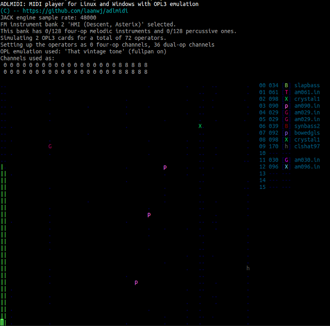

adlseq
=======

A softsynth with OPL3 emulation based on [ADLMIDI](http://bisqwit.iki.fi/source/adlmidi.html) by Joel Yliluoma.
It can currently take MIDI input from MIDI files or ALSA sequencer input.



ADLMIDI features:

* OPL3 emulation with four-operator mode support
* FM patches from a number of known PC games, copied from files typical to AIL = Miles Sound System / DMX / HMI = Human Machine Interfaces / Creative IBK.
* Stereo sound
* Reverb filter based on code from SoX, based on code from Freeverb. A copy of either project is not needed.
* Number of simulated soundcards can be specified as 1-100 (maximum channels 1800!)
* xterm-256color support
* WIN32 console support (also tested with HXRT / MS-DOS)
* Pitch-bender with adjustable range
* Vibrato that responds to RPN/NRPN parameters
* Sustain enable/disable
* MIDI and RMI file support
* loopStart / loopEnd tag support (Final Fantasy VII)
* Use automatic arpeggio with chords to relieve channel pressure
* Support for multiple concurrent MIDI synthesizers (per-track device/port select FF 09 message), can be used to overcome 16 channel limit

This fork adds the following:

* `adlseq`: listen on an ALSA sequencer socket and play MIDI events. This means that it can be connected
  to other MIDI sources (like games, keyboards or sequencer programs) with `aconnect` or the interface
  of the program itself.
* A legend showing what instrument is active on what MIDI channel
* Selectable OPL3 emulator (using `-emu=...`)
  * `dbopl`: Old DOSBOX OPL3.
  * `dboplv2`: New DOSBOX OPL3 (default, as in ADLMIDI).
  * `vintage`: 'That vintage tone' emulator by Robson Cozendey ported to C++
    from zdoom. A detailed description and Java applet version can be found on
    http://opl3.cozendey.com/. It is very accurate, but also CPU-heavy since
    this emulator uses floating point and has a more fine-grained envelope
    generator. It can produce sometimes a crystal-clear, denser kind of OPL3
    sound that, because of that, may be useful for creating other new music.
  * `ymf262`: YMF262 from MAME (via VGMPlay).
* Full stereo panning (using `-fp`). Instead of instruments popping from side to side, they can smoothly pan. Like in zdoom
  this is done with a small change to the emulators, instead of by duplicating the instrument on two channels as would be necessary
  with a real OPL3. Not yet supported for `ymf262` and `dboplv2` emulators.
* Performance improvements in the SDL audio output handling. The original ADLMIDI locks the audio buffer
  for a longer than needed due to unnecessary random-indexing in std::deque. Still a work in progress.
* Slight modularization and clean-up of the code (split ui, audio output, MIDI event processor into separate files)

This fork breaks the following:

* Tetris went missing in a code move :( Ideally this should be reintegrated, or else some roguelike game.
* Windows support (but should be easy to fix)

Usage
------
```
Usage: adlmidi <midifilename> [ <options> ] [ <banknumber> [ <numcards> [ <numfourops>] ] ]
       adlmidi <midifilename> -1   To enter instrument tester
 -p Enables adlib percussion instrument mode
 -t Enables tremolo amplification mode
 -v Enables vibrato amplification mode
 -s Enables scaling of modulator volumes
 -nl Quit without looping
 -w Write WAV file rather than playing
 -em=<emu> Set OPL emulator to use (dbopl, dboplv2, vintage, ym3812, ymf262)
 -fp Enable full stereo panning
 -bs Allow bank switch (Bank LSB changes bank)
    Banks: 0 = AIL (Star Control 3, Albion, Empire 2, Sensible Soccer, Settlers 2, many others)
           1 = Bisqwit (selection of 4op and 2op)
           2 = HMI (Descent, Asterix)
           3 = HMI (Descent:: Int)
           4 = HMI (Descent:: Ham)
           5 = HMI (Descent:: Rick)
           6 = HMI (Descent 2)
           7 = HMI (Normality)
           8 = HMI (Shattered Steel)
           9 = HMI (Theme Park)
          10 = HMI (3d Table Sports, Battle Arena Toshinden)
          11 = HMI (Aces of the Deep)
          12 = HMI (Earthsiege)
          13 = HMI (Anvil of Dawn)
          14 = DMX (Doom           :: partially pseudo 4op)
          15 = DMX (Hexen, Heretic :: partially pseudo 4op)
          16 = DMX (MUS Play       :: partially pseudo 4op)
          17 = AIL (Discworld, Grandest Fleet, Pocahontas, Slob Zone 3d, Ultima 4, Zorro)
          18 = AIL (Warcraft 2)
          19 = AIL (Syndicate)
          20 = AIL (Guilty, Orion Conspiracy, Terra Nova Strike Force Centauri :: 4op)
          21 = AIL (Magic Carpet 2)
          22 = AIL (Nemesis)
          23 = AIL (Jagged Alliance)
          24 = AIL (When Two Worlds War :: 4op, MISSING INSTRUMENTS)
          25 = AIL (Bards Tale Construction :: MISSING INSTRUMENTS)
          26 = AIL (Return to Zork)
          27 = AIL (Theme Hospital)
          28 = AIL (National Hockey League PA)
          29 = AIL (Inherit The Earth)
          30 = AIL (Inherit The Earth, file two)
          31 = AIL (Little Big Adventure :: 4op)
          32 = AIL (Wreckin Crew)
          33 = AIL (Death Gate)
          34 = AIL (FIFA International Soccer)
          35 = AIL (Starship Invasion)
          36 = AIL (Super Street Fighter 2 :: 4op)
          37 = AIL (Lords of the Realm :: MISSING INSTRUMENTS)
          38 = AIL (SimFarm, SimHealth :: 4op)
          39 = AIL (SimFarm, Settlers, Serf City)
          40 = AIL (Caesar 2 :: partially 4op, MISSING INSTRUMENTS)
          41 = AIL (Syndicate Wars)
          42 = AIL (Bubble Bobble Feat. Rainbow Islands, Z)
          43 = AIL (Warcraft)
          44 = AIL (Terra Nova Strike Force Centuri :: partially 4op)
          45 = AIL (System Shock :: partially 4op)
          46 = AIL (Advanced Civilization)
          47 = AIL (Battle Chess 4000 :: partially 4op, melodic only)
          48 = AIL (Ultimate Soccer Manager :: partially 4op)
          49 = AIL (Air Bucks, Blue And The Gray, America Invades, Terminator 2029)
          50 = AIL (Ultima Underworld 2)
          51 = AIL (Kasparov's Gambit)
          52 = AIL (High Seas Trader :: MISSING INSTRUMENTS)
          53 = AIL (Master of Magic, Master of Orion 2 :: 4op, std percussion)
          54 = AIL (Master of Magic, Master of Orion 2 :: 4op, orchestral percussion)
          55 = SB (Action Soccer)
          56 = SB (3d Cyberpuck :: melodic only)
          57 = SB (Simon the Sorcerer :: melodic only)
          58 = OP3 (The Fat Man 2op set)
          59 = OP3 (The Fat Man 4op set)
          60 = OP3 (JungleVision 2op set :: melodic only)
          61 = OP3 (Wallace 2op set, Nitemare 3D :: melodic only)
          62 = TMB (Duke Nukem 3D)
          63 = TMB (Shadow Warrior)
          64 = DMX (Raptor)
     Use banks 2-5 to play Descent "q" soundtracks.
     Look up the relevant bank number from descent.sng.

     The fourth parameter can be used to specify the number
     of four-op channels to use. Each four-op channel eats
     the room of two regular channels. Use as many as required.
     The Doom & Hexen sets require one or two, while
     Miles four-op set requires the maximum of numcards*6.
```

`adlseq` works the same way and currently needs a dummy file argument, then optional
switches, then the bank,

```bash
adlseq dummy -fp -emu=vintage 64
```

It will then print on what port it is listening, for example:
```
Waiting for data at port 129:0.
```

It is not currently possible to provide port(s) to connect to on the command line.

Interface
----------

The grid on the left shows which instruments are playing on which
OPL channels by drawing a text character. The horizontal position is
determined by the pitch of the note, the vertical position by the channel
number. Four-operator or pseudo-4op instruments will be active on two channels.

- An empty space or `.` means that there is no activity.
- A colored letter means an instrument is playing at the pitch and on the channel. Each instrument gets
  an unique letter/color if possible.
- `<` means an instrument was played with a pitch bend.
- `%` means that the note is releasing (mistakingly, I think, called sustaining in the source).

Diagnostic messages are overlayed on this in blue text.

The right pane shows a legend of what instrument is active on each of the 16 MIDI channels. The
numbers shown are subsequently

1) the channel number
2) the patch number (0..127 for normal patches, 128..255 for percussion)
3) the symbol used to render this instrument in the grid

Build
------
If necessary, first install the dependencies. On Ubuntu:

```bash
sudo apt-get install libsdl1.2-dev libasound2-dev
```

Then just type
```bash
make
```
And it should build all the executables:
- `adlmidi`: MIDI player
- `adlseq`: ALSA sequencer
- `adltester`: Instrument tester
- `gen_adldata`: Generate `adldata.cc` (only needed if you want to add instrument banks)
- `dumpmiles`
- `dumpbank`

Known issues
-------------
- Unlike in the MIDI player, in `adlseq` processing of events is quantized per 512 samples.
This can cause audible timing (or interference) issues in some cases when one event is processed and another is
processed ~10ms later.
- To accomodate zdoom's OPL emulators, the OPL frequency was changed to 49716
  instead of 48000. This is the frequency as used by the original chips,
  but it means that resampling is necessary. Pulseaudio can do this,
  but other SDL audio backends may not.
- The legend display only shows 16 MIDI channels, even if more are active through device/port select commands.

Copying
--------
ADLMIDI is distributed under the terms of the General Public License version 3 (GPL3).

The OPL3 emulator within is from DOSBox is licensed under GPL2+.

The FM soundfonts (patches) used in the program are imported from various PC
games without permission from their respective authors. The question of
copyright, when it comes to sets of 11 numeric bytes, is somewhat vague,
especially considering that most of those sets are simply descendants of the
patch sets originally published by AdLib Inc. for everyone's free use.

OPL3 emulators:
  * `dbopl`: Available under the terms of the GNU LGPL.
  * `dboplv2`: Available under the terms of the GNU GPL2+.
  * `vintage`: Available under the terms of the GNU LGPL.
  * `ymf262`,`ym3812`: Available under non-commercial, open-source license terms (MAME license).

Authors
--------
* Joel Yliluoma <bisqwit@iki.fi>
* Wladimir J. van der Laan <laanwj@gmail.com>

See also
---------

* [ADLMIDI](http://bisqwit.iki.fi/source/adlmidi.html) site by Joel Yliluoma 
* [OPL synth emulation](http://zdoom.org/wiki/OPL_synth_emulation) on ZDoom wiki

